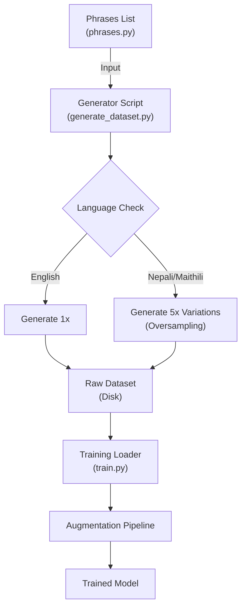

# WiseYak Wake Word Engine

**Architecture:** openWakeWord adaptation for "Namaste Deepa" / "Hello Deepa".
**Stack:** Python (Training/Verification), ONNX Runtime (Web Inference).

## 1. Data Generation Strategy

We don't rely on massive collected datasets. We synthesize them.

*   **Positive Samples**: Generated using Piper TTS (high quality), Edge-TTS, and Google Cloud TTS. We permute specific phrases ("Namaste Deepa", "Hello Deepa") across different speeds, pitches, and speaker embeddings.
*   **Negative Samples**:
    *   **Hard Negatives**: Adversarial generation using phonetically similar words ("Deepak", "Deep", "Namaskar").
    *   **Background Noise**: Mixed with MUSAN and custom noise datasets to ensure robustness.
*   **Augmentation**: RIR (Room Impulse Response) simulation for reverberation and additive gaussian noise during training hardens the model against real-world acoustics.

## 2. Training Pipeline

Training is handled by `training/train_oww.py`.

1.  **Feature Extraction**: Audio is converted to melspectrograms.
2.  **Embedding**: We use a pre-trained microwakeword embedding model (96-dimensional vectors). This is the "secret sauce" - we only train the final classification head, not the whole stack.
3.  **Classification**: A small fully-connected network takes the 96-dim embeddings history and outputs a probability.

## 3. Inference Pipeline

### Python (`wise_ui_test/test_local_onnx.py`)
This is the reference implementation. It works perfectly because:
*   `openwakeword` library handles the streaming buffer (windowing) automatically.
*   `sounddevice` provides clean raw PCM audio.
*   Input is naturally 16-bit PCM, matching the model's training data.

### Web / JavaScript (`wise_ui_test/test_pipeline_browser.html`)
The browser implementation is tricky. We manually reconstruct the Python logic in JS:
*   **AudioWorklet**: Browser audio is Float32 (44.1/48kHz). We must downsample to 16kHz and cast to Int16 without introducing aliasing artifacts.
*   **ONNX Chaining**: We execute 3 models sequentially per chunk: `Mel` -> `Embedding` -> `Classifier`.
*   **Latency**: If Javascript garbage collection kicks in or the main thread blocks, we lose audio frames. The Python GIL doesn't have this specific real-time contention issue in the same way.

## 4. Usage

**Requirements**
`pip install -r requirements.txt`

**Run Verification (Python)**
`python wise_ui_test/test_local_onnx.py`

**Train New Model**
`python training/train_oww.py --config training/oww_configs/deepak.yaml`

**Web Deployment**
Host `wise_ui_test/` on a secure server (HTTPS). Ensure `melspectrogram.onnx` and `embedding_model.onnx` are in the root directory alongside your custom model.
    *   **RIR (Room Impulse Response)**: Echo/Reverb
    *   **Noise Mixing**: Coffee shop, Rain, Traffic
    *   **Pitch/Speed Shift**: Robustness to different speakers

We faced a massive data imbalance: limited real-world recordings vs. the need for robust language detection. We solved this with a **Synthetic Boosting Strategy**.



### **1. 5x Oversampling for Low-Resource Languages**
Since standard TTS engines lack dedicated Maithili voices, we use phonetically similar Hindi voices. To compensate for the lack of distinct data, we **mathematically oversample** Nepali and Maithili by generating **5 times more variations** (Pitch/Speed shifts) than English. This ensures the model treats all languages with equal importance.

### **2. Advanced Augmentation Pipeline (Optimized)**
To bridge the "Sim-to-Real" gap (making TTS sound like a real mic in a room), we apply multiple layers of augmentation on-the-fly during training. The pipeline uses **`audiomentations`** for 10x faster processing vs. librosa, with **`joblib`** for parallel data loading.

| Augmentation | Purpose | Implementation |
| :--- | :--- | :--- |
| **Pitch & Speed Shift** | Robustness to different speakers. | `audiomentations.PitchShift` + `TimeStretch` (optimized C backend) |
| **Gaussian Noise + Gain** | Volume/noise variance. | `audiomentations.AddGaussianNoise` + `Gain` |
| **Room Impulse Response (RIR)** | Simulates walls, echoes, and room physics. | Custom: `scipy.signal.fftconvolve` with exponential decay noise. |
| **Background Mixing** | Teaches model to ignore noise. | Overlays coffee shop noise, rain, traffic at varying SNR. |
| **SpecAugment** | Robustness to packet loss / mic glitches. | Randomly masks blocks of **Time** and **Frequency** in the MFCC. |

> **Performance**: Data loading optimized from **5+ hours → ~20-30 minutes** on Kaggle/Colab.

---

## Project Structure

- **`training/train.py`**: The brain. Handles loading, Augmentation (RIR/SpecAugment), Model Definition (FCN), and Training.
- **`scripts/generate_dataset.py`**: The factory. Uses EdgeTTS/GoogleTTS to create thousands of samples.
- **`scripts/phrases.py`**: The knowledge base. Contains 100+ phrases in EN, NE, MO.
- **`web/`**: The frontend. Contains `app.js` (Inference logic) and `wakeword_model.tflite`.
- **`scripts/run_web.py`**: Custom Python server to serve WASM files correctly.

---

## How to Run

### 1. Training (Google Colab / Kaggle)
1.  Zip the dataset: `Compress-Archive data dataset.zip`
2.  Upload `dataset.zip` and `training/train.py` to Colab/Kaggle.
3.  Install dependencies:
    ```bash
    pip install audiomentations joblib
    ```
4.  Run training (uses all CPU cores automatically).
5.  Download `wakeword_model.tflite`.

### 2. Live Testing (Local)
1.  Place model in `web/`.
2.  Run the custom server (supports WASM):
    ```bash
    python scripts/run_web.py
    ```
3.  Open `http://localhost:8000`.
4.  Say "**Deepak**" or "**Deepa**" in different accents!

---

## Verification
The model is validated using a **Confusion Matrix**.
*   **Goal:** A clean diagonal line.
*   **Success:** 98%+ Accuracy on Validation Set.
*   **Safety:** "Background" Recall > 99% (No false positives).

---
*Built for WiseYak.*