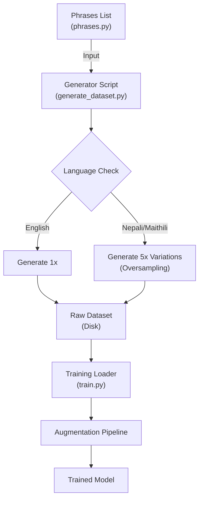

# WiseYak "Deepak/Deepa" Wake Word Engine
**Adaptive, Multi-Language Wake Word Detection (English, Nepali, Maithili)**

This project implements a robust **Wake Word Detection System** capable of distinguishing not just the keyword ("Deepak" or "Deepa"), but also the **Language** (English / Nepali / Maithili) and **Gender** based on phonetics and accent.

---

## System Architecture

The core of the system is a **7-Class Fully Convolutional Neural Network (FCN)**.

### **The 7 Classes**
1.  **Background** (Silence, Noise, Speech) - *Heavily penalized for false triggers*
2.  **Deepa (EN)** - "Hey there Deepa"
3.  **Deepa (NE)** - "Namaste Deepa"
4.  **Deepa (MAI)** - "Pranam Deepa"
5.  **Deepak (EN)** - "Hey there Deepak"
6.  **Deepak (NE)** - "Namaste Deepak"
7.  **Deepak (MAI)** - "Pranam Deepak"

---

## Robust Training Features (openWakeWord-Inspired)

We use advanced techniques to ensure the model is **robust against false positives**:

1.  **Strict Phonetic Anchors**: Model learns `[Greeting] + [Name]`. Just saying "Deepak" is treated as a negative sample.
2.  **Focal Loss (γ=2.0)**: Forces the model to focus on "hard negatives" (background speech that sounds like the wake word).
3.  **False Positive Penalty (5.0x)**: The loss function penalizes background false alarms **5x more** than missed detections.
4.  **Augmentation**: Simulates real-world conditions with:
    *   **RIR (Room Impulse Response)**: Echo/Reverb
    *   **Noise Mixing**: Coffee shop, Rain, Traffic
    *   **Pitch/Speed Shift**: Robustness to different speakers

We faced a massive data imbalance: limited real-world recordings vs. the need for robust language detection. We solved this with a **Synthetic Boosting Strategy**.



### **1. 5x Oversampling for Low-Resource Languages**
Since standard TTS engines lack dedicated Maithili voices, we use phonetically similar Hindi voices. To compensate for the lack of distinct data, we **mathematically oversample** Nepali and Maithili by generating **5 times more variations** (Pitch/Speed shifts) than English. This ensures the model treats all languages with equal importance.

### **2. Advanced Augmentation Pipeline (Optimized)**
To bridge the "Sim-to-Real" gap (making TTS sound like a real mic in a room), we apply multiple layers of augmentation on-the-fly during training. The pipeline uses **`audiomentations`** for 10x faster processing vs. librosa, with **`joblib`** for parallel data loading.

| Augmentation | Purpose | Implementation |
| :--- | :--- | :--- |
| **Pitch & Speed Shift** | Robustness to different speakers. | `audiomentations.PitchShift` + `TimeStretch` (optimized C backend) |
| **Gaussian Noise + Gain** | Volume/noise variance. | `audiomentations.AddGaussianNoise` + `Gain` |
| **Room Impulse Response (RIR)** | Simulates walls, echoes, and room physics. | Custom: `scipy.signal.fftconvolve` with exponential decay noise. |
| **Background Mixing** | Teaches model to ignore noise. | Overlays coffee shop noise, rain, traffic at varying SNR. |
| **SpecAugment** | Robustness to packet loss / mic glitches. | Randomly masks blocks of **Time** and **Frequency** in the MFCC. |

> **Performance**: Data loading optimized from **5+ hours → ~20-30 minutes** on Kaggle/Colab.

---

## Project Structure

- **`training/train.py`**: The brain. Handles loading, Augmentation (RIR/SpecAugment), Model Definition (FCN), and Training.
- **`scripts/generate_dataset.py`**: The factory. Uses EdgeTTS/GoogleTTS to create thousands of samples.
- **`scripts/phrases.py`**: The knowledge base. Contains 100+ phrases in EN, NE, MO.
- **`web/`**: The frontend. Contains `app.js` (Inference logic) and `wakeword_model.tflite`.
- **`scripts/run_web.py`**: Custom Python server to serve WASM files correctly.

---

## How to Run

### 1. Training (Google Colab / Kaggle)
1.  Zip the dataset: `Compress-Archive data dataset.zip`
2.  Upload `dataset.zip` and `training/train.py` to Colab/Kaggle.
3.  Install dependencies:
    ```bash
    pip install audiomentations joblib
    ```
4.  Run training (uses all CPU cores automatically).
5.  Download `wakeword_model.tflite`.

### 2. Live Testing (Local)
1.  Place model in `web/`.
2.  Run the custom server (supports WASM):
    ```bash
    python scripts/run_web.py
    ```
3.  Open `http://localhost:8000`.
4.  Say "**Deepak**" or "**Deepa**" in different accents!

---

## Verification
The model is validated using a **Confusion Matrix**.
*   **Goal:** A clean diagonal line.
*   **Success:** 98%+ Accuracy on Validation Set.
*   **Safety:** "Background" Recall > 99% (No false positives).

---
*Built for WiseYak.*
